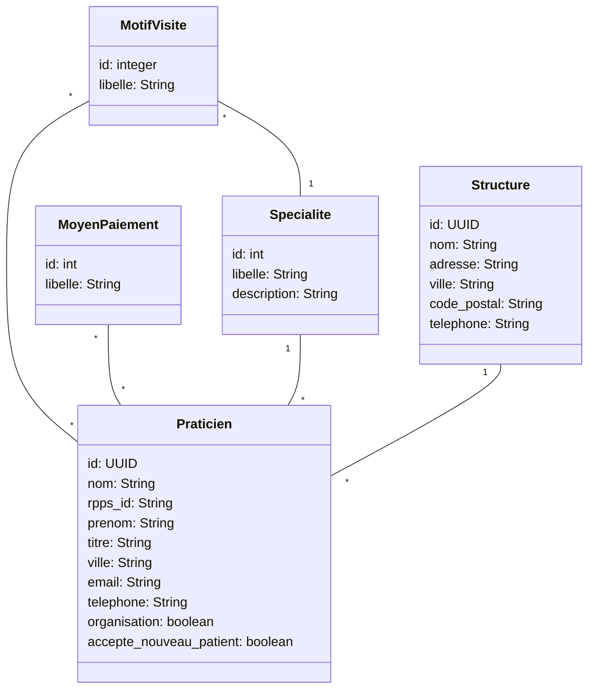

IUT Nancy Charlemagne
Département d'Informatique
BUT 3 Informatique - DWM

# Nouveaux Paradigmes de Bases de Données

## TD 1 : Utiliser l'ORM Doctrine

**Objectif :** Maitriser l'ORM Doctrine pour une utilisation courante

On considère la base de données dont le schéma et le contenu est disponible dans arche (version sql pour postgres). Cette base de données correspond au modèle de domaine suivant (souvenir, souvenir:).

Ecrire les requêtes et manipulations de données proposées dans la suite en utilisant l'ORM Doctrine. Créer les entités et les mappings au fur et à mesure des besoins.

### Exercice 1 : utilisation élémentaire

1. afficher la spécialité d'identifiant 1 : id, libellé, description.
2. Afficher le praticien dont l’id est : 8ae1400f-d46d-3b50-b356-269f776be532 - id, nom prénom, ville, email, téléphone
3. Compléter en affichant sa spécialité et sa structure de rattachement.
4. afficher la structure 3444bdd2-8783-3aed-9a5e-4d298d2a2d7c avec la liste de praticiens.
5. afficher la spécialité d'identifiant 1 et les motifs de visite associés
6. praticien 8ae1400f-d46d-3b50-b356-269f776be532 : afficher la liste de ses motifs de visite
7. Créer un praticien, spécialité pédiatrie, et le sauvegarder dans la base,
8. Modifier ce praticien : le rattacher à la structure "Cabinet Bigot", changer sa ville pour "Paris", ajouter des motifs de visite et sauvegarder dans la base.
9. Supprimer ce praticien et mettre à jour la base.

## Exercice 2 : requêtes avec conditions de sélection

1. Afficher le praticien dont le mail est Gabrielle.Klein@live.com (requête simple)
2. Afficher le praticien de nom Goncalves à Paris (requête simple)
3. Afficher la spécialité de libellé 'pédiatrie' ainsi que les praticiens associés. (requête simple)
4. afficher les types de groupements contenants 'santé' dans leur description (utiliser une requête critères)
5. afficher les praticiens de la spécialité ‘ophtalmologie exerçants à Paris

## Exercice 3 : Repository et DQL

Traiter les questions qui suivent sous la forme d'une méthode dans un repository dédié à l'entité concernée. Les requêtes seront programmées en DQL.

1. liste des spécialités contenant un mot clé dans le libellé ou la description,
2. liste des praticiens dont la spécialité contient un mot-clé dans le libellé ou la description
3. liste des praticiens d’une spécialité et acceptant un moyen de paiement donné.
