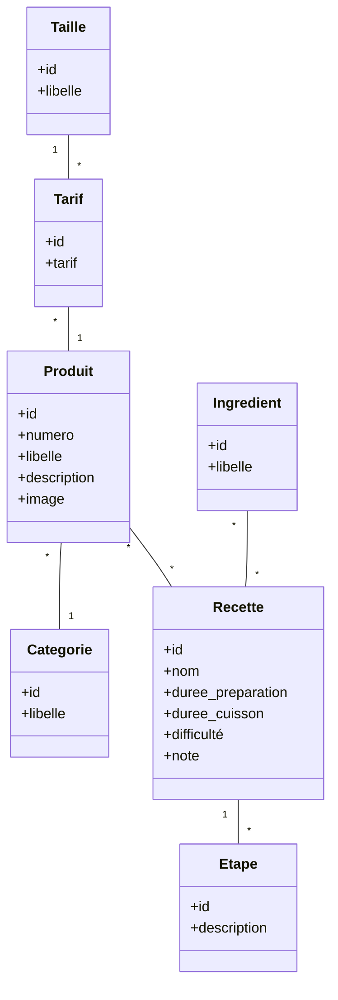

IUT Nancy Charlemagne
Département d'Informatique
BUT 3 Informatique - DWM

# Nouveaux Paradigmes de Bases de Données

## TD 2 : utiliser MongoDB

## Préparation

Récupérer l'archive squelette pour le td3 dans arche.

Adapter le fichier `docker-compose.yml` et démarrer les services correspondant. Ce fichier de composition a les caractéristiques suivantes :

* un service `php` montant le répertoire `./app` sur `/var/php/` ; il est basé sur une image php 8.3-cli construite à l’aide du dockerfile fourni. Il peut être construit sur une image php quelconque à condition que l'extension php mongo soit installée,
* un service `mongo`, basé sur l'image officielle mongo et montant le répertoire `./data` sur `/var/data` ; le port utilisé par le serveur mongo est le 27017, il faut le rediriger vers ce même port ou un autre de l'hôte.

Dans le conteneur docker du service php, installer la librairie `mongodb/mongodb` en utilisant le fichier `composer.json` fourni.

## Création de la base

On considère la base de données "chopizza" qui représente le catalogue d'un vendeur de pizza bien connu. En plus de son catalogue de produits, classés par catégories, le vendeur met à disposition de ses clients des recettes liées aux produits qu'il propose. Le modèle conceptuel est le suivant.




Des données prêtes à être importées dans mongodb sont fournies sous la forme de tableaux json. Elles se trouvent dans le répertoire `data` du squelette.

Importer les données dans la base mongo en créant 2 collections : produits et recettes.

Pour cela, deux possibilités :

* installer et utiliser l'application MongoDB Compass qui permet d'interagir avec un serveur

mongodb,

* utiliser l'utilitaire mongoimport : exécutez la commande suivante **à l'intérieur du conteneur mongo** :

```bash
>mongoimport -db chopizza --collection produits --jsonArray < file.json
```

## 1. Requêtes simples sur mongoshell

1. liste des produits :
2. compter les produits :
3. lister les produits en les triant par numero décroissant
4. Le produit de libellé "Margherita"
5. produits de la catégorie "Boissons"
6. liste des produits, afficher caategorie, numero, libelle
7. idem avec en plus la taille et le tarif
8. produits avec un tarif < 8.0
9. produits avec un tarif grande taille < 8.0
10. insérer un nouveau produit
11. les recettes associées au produit 1 :

## 2. Requêtes en PHP

1. afficher la liste des produits: numero, categorie, libelle
2. afficher le produit numéro 6, préciser : libellé, catégorie, description, tarifs
3. liste des produits dont le tarif en taille normale est <= 3.0
4. liste des produits associés à 4 recettes
5. afficher le produit n°6, compléter en listant les recettes associées (nom et difficulté)
6. créer une fonction qui reçoit en paramètre un numéro de produit et une taille et retourne un tableau contenant les données descriptives de ce produit : numéro, libellé, catégorie, taille, tarif ; utiliser cette fonction et afficher le résultat en json.

## 3. Application

construire une mini application permettant de naviguer dans le catalogue de produits en y accédant par catégorie. On affichera le numéro, libellé et description du produits, ainsi que le tarif pour chaque taille.

Compléter l’application avec un formulaire d’ajout d’un produit. La catégorie et les différentes tailles seront sélectionnées dans une liste déroulante.
