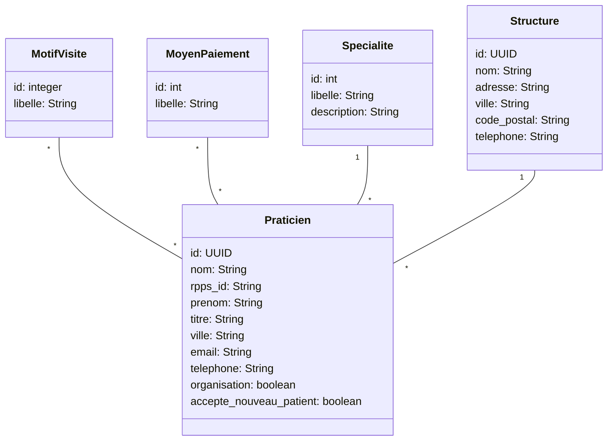

IUT Nancy Charlemagne
Département d'Informatique
BUT 3 Informatique - DWM

# Nouveaux Paradigmes de Bases de Données

## TD 3 : utiliser le CMS Headless Directus

### Préparation

Installer l'outil Directus en version Docker.
Vous trouverez la documentation utile ici : [https://docs.directus.io/self-hosted/docker-guide.html](https://docs.directus.io/self-hosted/docker-guide.html)
Personnalisez quelques éléments, notamment les données de connexion.

### Création des données

On souhaite réaliser un backend de gestion des données pour une application de gestion de praticiens de santé. Le modèle du domaine correspond au schéma UML suivant.

Créer le modèle dans le backoffice Directus, puis insérer des données dans les tables.

Indication : si vous créez une structure calquée sur celle utilisée pour le TD Doctrine, vous pourrez exporter les données de la base du TD2 et les importer dans Directus. Pour cela exporter au format CSV avec " ;". Attention à l'ordre d'import qui doit tenir compte des contraintes de référence.

### API REST

Utiliser l'api REST pour obtenir les données suivantes

* liste des praticiens
* la spécialité d'ID 2
* la spécialité d'ID 2, avec uniquement son libellé
* un praticien avec sa spécialité (libellé)
* une structure (nom, ville) et la liste des praticiens rattachés (nom, prenom)
* idem en ajoutant le libellé de la spécialité des praticiens,
* Les structures dont le nom de la ville contient "sur" avec la liste des praticiens (nom, prénom, spécialité).
